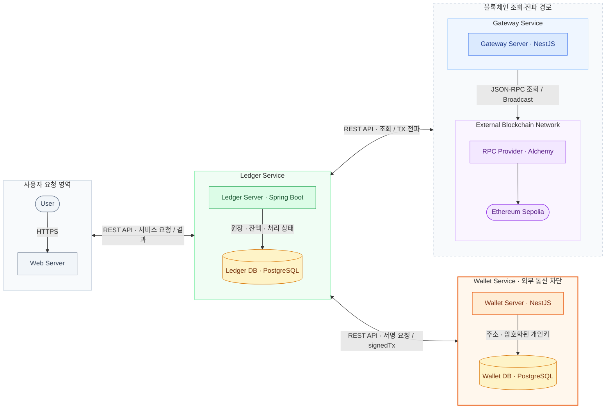

# custody-core
A ledger-based blockchain custody wallet backend.

## Architecture

```mermaid
flowchart LR
    subgraph APP["사용자 요청 영역"]
        direction TB

        USER(["User"])
        WEB["Web Server"]

        USER -->|"HTTPS"| WEB
    end

    subgraph CORE["Ledger Service"]
        direction TB

        LEDGER["Ledger Server · Spring Boot"]
        LDB[("Ledger DB · PostgreSQL")]

        LEDGER -->|"원장 · 잔액 · 처리 상태"| LDB
    end

    subgraph GATEWAY_PATH["블록체인 조회·전파 경로"]
        direction TB

        subgraph GATEWAY_SERVICE["Gateway Service"]
            GW["Gateway Server · NestJS"]
        end

        subgraph EXTERNAL["External Blockchain Network"]
            direction TB

            RPC["RPC Provider · Alchemy"]
            CHAIN(["Ethereum Sepolia"])

            RPC --> CHAIN
        end

        GATEWAY_SERVICE -->|"JSON-RPC 조회 / Broadcast"| EXTERNAL
    end

    subgraph WALLET_SERVICE["Wallet Service · 외부 통신 차단"]
        direction TB

        WALLET["Wallet Server · NestJS"]
        WDB[("Wallet DB · PostgreSQL")]

        WALLET -->|"주소 · 암호화된 개인키"| WDB
    end

    APP <-->|"REST API · 서비스 요청 / 결과"| CORE

    CORE <-->|"REST API · 조회 / TX 전파"| GATEWAY_PATH
    CORE <-->|"REST API · 서명 요청 / signedTx"| WALLET_SERVICE

    classDef web fill:#f1f5f9,stroke:#64748b,color:#334155
    classDef core fill:#dcfce7,stroke:#16a34a,color:#14532d
    classDef gateway fill:#dbeafe,stroke:#2563eb,color:#1e3a8a
    classDef wallet fill:#ffedd5,stroke:#ea580c,color:#7c2d12
    classDef storage fill:#fef3c7,stroke:#d97706,color:#78350f
    classDef external fill:#f3e8ff,stroke:#9333ea,color:#581c87

    class USER,WEB web
    class LEDGER core
    class GW gateway
    class WALLET wallet
    class LDB,WDB storage
    class RPC,CHAIN external

    style APP fill:#f8fafc,stroke:#cbd5e1
    style CORE fill:#f0fdf4,stroke:#86efac
    style GATEWAY_PATH fill:#f8fafc,stroke:#cbd5e1,stroke-dasharray:5 5
    style GATEWAY_SERVICE fill:#eff6ff,stroke:#93c5fd
    style EXTERNAL fill:#faf5ff,stroke:#d8b4fe
    style WALLET_SERVICE fill:#fff7ed,stroke:#ea580c,stroke-width:2px
```
